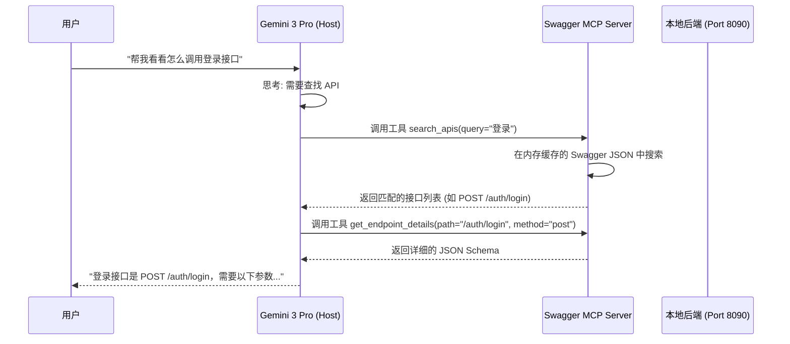

# 针对 Swagger 文档的 MCP 服务开发指南

## 1. 什么是 MCP (Model Context Protocol)?

MCP (Model Context Protocol) 是一个开放标准，允许 AI 模型（如 Gemini 3 Pro、Claude 等）安全地连接到本地或远程的数据源和工具。

### 核心原理
MCP 采用 **客户端-主机-服务器 (Client-Host-Server)** 架构：

1.  **MCP Host (主机)**: 运行 AI 模型的应用程序（例如 IDE、Windsurf、Claude Desktop 等）。它负责与 AI 对话。
2.  **MCP Client (客户端)**: 主机内部的组件，负责与 MCP 服务器通信。
3.  **MCP Server (服务器)**: **这就是我们要开发的组件**。它是一个轻量级的进程，能够：
    *   **暴露资源 (Resources)**: 让 AI 读取文件或数据（例如：读取 Swagger JSON）。
    *   **提供工具 (Tools)**: 让 AI 执行操作（例如：搜索接口、刷新文档）。
    *   **提供提示词 (Prompts)**: 预定义的指令模板。

**简单来说**：你的 Swagger MCP Server 就像一个“翻译官”，它帮你把 Swagger 文档里的复杂 JSON 数据，转换成 AI 能看懂并能调用的“工具”和“文本”。

---

## 2. 系统设计方案

我们要构建一个 MCP Server，作为 Gemini 3 Pro 和你的本地 Swagger 服务 (`http://localhost:8090`) 之间的桥梁。

### 2.1 数据源
*   **Swagger JSON 地址**: `http://localhost:8090/v3/api-docs`
*   **Swagger UI**: `http://localhost:8090/swagger-ui/index.html` (主要供人类查看，MCP 主要与 JSON 数据交互)

### 2.2 核心功能 (Tools)

为了满足你“查询接口所有内容”、“刷新”、“检索”的需求，我们设计以下工具：

1.  **`refresh_docs`**:
    *   **功能**: 强制从 `http://localhost:8090/v3/api-docs` 重新下载最新的 API 定义。
    *   **场景**: 当你修改了后端代码并重启服务后，通知 AI 更新缓存。

2.  **`list_endpoints`**:
    *   **功能**: 列出所有可用的 API 路径 (Paths) 和请求方法 (GET, POST 等) 的摘要。
    *   **场景**: AI 需要知道有哪些功能可用时。

3.  **`get_endpoint_details`**:
    *   **功能**: 获取指定路径和方法的详细信息（请求参数、RequestBody 结构、响应示例等）。
    *   **参数**: `path` (例如 `/users`), `method` (例如 `post`)。
    *   **场景**: 当你要写代码调用某个具体接口时。

4.  **`search_apis`**:
    *   **功能**: 根据关键词搜索 API 的摘要和描述。
    *   **参数**: `query` (关键词)。
    *   **场景**: "帮我找一下有没有修改用户密码的接口"。

### 2.3 工作流程图

---

## 3. 开发步骤详解

我们将使用 **Node.js** 和 **TypeScript** 来开发这个服务（这是目前 MCP 支持最完善的生态）。

### 第一步：环境准备
确保你安装了：
*   Node.js (v18 或更高版本)
*   npm 或 pnpm

### 第二步：项目初始化
我们将创建一个新的项目文件夹，安装 MCP SDK 和必要的库（如 `axios` 用于请求 Swagger 接口）。

### 第三步：编写代码
核心逻辑包括：
1.  启动时，用 `axios` 获取 `/v3/api-docs` 的 JSON 数据并缓存在内存中。
2.  使用 MCP SDK 定义上述 4 个工具。
3.  实现工具的逻辑：解析 Swagger JSON 对象。

### 第四步：配置 MCP Host
在你的 IDE 或 MCP 客户端配置文件中，添加这个 Server 的启动命令。

---

## 4. 下一步计划

如果你同意这个方案，我可以现在就开始为你搭建项目框架并编写代码。

**你需要做的是：**
1.  确认你的本地环境已安装 Node.js。
2.  确认 `http://localhost:8090/v3/api-docs` 目前是否可以访问（或者你是否可以启动它）。

请告诉我是否开始编写代码？
